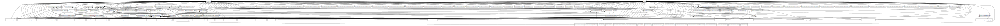

# Report for assignment 4

## Project

Name: `python-discord/sir-lancebot`

URL: https://github.com/python-discord/bot/tree/main

It is a Discord bot built by the Python Discord community, for the Python Discord community. It started out as a community project during Hacktoberfest 2018 to help introduce and encourage members to participate in contributing to open source.

## Onboarding experience

We chose a new project, because the last project only had a few issues up for grab, and they were trivial changes.

For the onboarding experience, since the two projects are both maintained by `python-discord`, the onboarding experience is more or less the same.

However, there is a small caveat with setting up the `.env` files, as the setup process differed from that of `python-discord/bot`, which confused some of us. It also required manual copying of channel IDs, rather than having an automatic script that does everything for you.

## Effort spent

For each team member, how much time was spent in

1. plenary discussions/meetings (applies to everyone);
    * 24 Feb - 2.5 hour(s)
    * 26 Feb - 2 hour(s)
    * 3 feb - 1.5 hour(s)

2. discussions within parts of the group;
    * N/A, we value transparency

3. reading documentation;
    * Kim - 0.25 hour(s)
    * Johan - 0.5 hour(s)
    * Marcello - 1.5 hour(s)
    * Arvid - 1 hour(s)

4. configuration and setup;
    * Kim - 0.5 hour(s)
    * Arvid - 1.5 hour(s)
    * Johan - 0.5 hour(s)
    * Marcello - 0.5 hour(s)

5. analyzing code/output;
    * Kim - 2 hour(s)
    * Johan - 1 hour(s)
    * Marcello - 1 hour(s)
    * Arvid - 1 hour(s)

6. writing documentation;
    * Kim - 2 hour(s)
    * Johan - 2.5 hour(s)
    * Marcello - 2.5 hour(s)

7. writing code;
    * Kim - 12 hour(s)
    * Johan - 10 hour(s)
    * Marcello - 10 hour(s)
    * Arvid - 8 hour(s)

8. running code?
    * Kim - 0.75 hour(s)
    * Johan - 1 hour(s)
    * Marcello - 1 hour(s)
    * Arvid - 1 hour(s)

For setting up tools and libraries (step 4), enumerate all dependencies
you took care of and where you spent your time, if that time exceeds
30 minutes.

## Overview of issue(s) and work done.

Title: Text Based Adventure

URL: https://github.com/python-discord/sir-lancebot/issues/238

It is a feature request for a text-based RPG adventure game that can be played using the bot.

Scope (functionality and code affected):
- We will need to add a new `adventure.py` file, which includes an `Adventure` class as an entry point for the Cog, along with the `GameSession` class for handling the game logic.
- Write a playable prototype of your game as a bot command.
    - [x] Write a playable prototype of your game as a bot command.
        - [x] Use `.adventure [game_code]` or `.adventure [index]` to play the game.
        - [x] Use `.adventures` or `.adventure` to view a list of available games.
    - [x] Make all player interactions reactions instead of having the player type commands.
    - [x] Make the entire game happen in a single message that the bot edits, instead of having the bot post new messages.
    - [x] Make a system that is possible to easily extend with new campaigns.
        - [x] Define your own rooms, choices, collectibles (i.e., effects) and endings in a JSON format!
        - [x] Customize game settings such as embed color, timeout seconds, etc.
        - [x] Display a list of available games.
        - [x] Display an error message if the game does not exist.
    - [x] Support multiple concurrent games.
        - [x] One player can instantiate multiple games at once.
        - [x] More than one game can be played at the same time, and only the player can react to their own game.
    - [x] Add graphic assets to show off stuff like bosses on special rooms.

## Requirements for the new feature

#### Requirement #1: No noisy implementation
The adventure game should be implemented in a way that it does not post dozens of messages every time you play a game (e.g. update a single embed, player input through emote reactions)
##### Requriment #1.1: Update embed
The adventure game should update a single embed to tell the story
##### Requriment #1.2: Input through emote reactions
The adventure game should use emote reactions to navigate through the game

#### Requirement #2: Implement a dynamic story
The adventure game should be able to handle multiple endings and support unlocking paths depending on the players choices

#### Requirement #3: Extensibility
The adventure game should support adding new stories (e.g. by crating a YAML, TOML or JSON file) in order to allow for other members of the community to easily create new adventures

#### Requirement #4: Support for graphics
The adventure game should offer support for showing graphics of rooms and bosses

#### Requirement #5: Secure against exploits
The adventure game should not allow any exploits to be used through the user input.


The tests have been traced to the respective requirements in the form of comments in the code. However, it was not feasible to create tests for requirement #4, thus there are no tests for this requirement. Tests for requirement #4 require a deeper lever of channel mocking that we were not able to produce.

<!-- Optional (point 3): trace tests to requirements.
* TODO: Update this section -->

## Code changes

### Patch

The adventure feature branch: [link](https://github.com/dd2480-spring-2025-group-1/sir-lancebot/pull/2)

The tests branch: [link](https://github.com/dd2480-spring-2025-group-1/sir-lancebot/pull/5)
> The dev team for the upstream project was not interested in having tests added, thus we will keep our tests in a separate branch on top of the feature branch.
>
> After checking out the branch, please make sure to run `poetry install` again in order to install the extra dependencies need for testing and to set up the testing commands. Then you can run all tests by running `poetry run task test`
>
> For more detailed information on running the tests, please refer to the instructions in [`tests/README.md`](https://github.com/dd2480-spring-2025-group-1/sir-lancebot/tree/1-add-unittests/tests#readme).


Optional (point 4): the patch is clean.
* We built `adventure.py` based off `helper.py`.
* All obsolete code are removed.
* It does not produce extraneous output.
* There are no whitespace changes as they're handled by linters in precommit hooks.

Optional (point 5): considered for acceptance (passes all automated checks).
* [Link to upstream PR](https://github.com/python-discord/sir-lancebot/pull/1653)

## Test results

There were no test coverage on this bot, and we had to implement our own.

We decided to adapt the test setup from [python-discord/bot](https://github.com/python-discord/bot), since the architecture of this project is very similar to that of our chosen project.

We only aim to write tests for the functions and files that we implement ourselves, but we imported both the test helper functions and their respective tests (located in `./tests/helpers.py` and `./tests/test_helpers.py` respectively) in order to facilitate testing.

Attached below is a sample run of the tests after our implementation:
```
$ poetry run task test

============================= test session starts ==============================
platform linux -- Python 3.12.9, pytest-8.3.4, pluggy-1.5.0
rootdir: /home/mk/Downloads/gitthings/sir-lancebot
configfile: pyproject.toml
plugins: cov-6.0.0, anyio-4.8.0, subtests-0.14.1, xdist-3.6.1
created: 1/1 worker
1 worker [51 items]

...................................................                      [100%]
=============================== warnings summary ===============================
[truncated]

-- Docs: https://docs.pytest.org/en/stable/how-to/capture-warnings.html
==================================== PASSES ====================================
======================= 51 passed, 35 warnings in 1.78s ========================

```

One can also get a coverage report by first running `poetry run task test-cov`, and then `poetry run task report --functions bot/exts/fun/adventure.py` to get the coverage report for the `adventure.py` file by functions.

Attached below is a sample run of the coverage report after our implementation:
```
$ poetry run task report --functions bot/exts/fun/adventure.py
Name                                                                        Stmts   Miss Branch BrPart  Cover
-------------------------------------------------------------------------------------------------------------
bot/exts/fun/adventure.py                                                     257     56     62      9    71%
bot/exts/fun/adventure.py: function Adventure.list_adventures                   1      1      0      0     0%
bot/exts/fun/adventure.py: function Adventure.new_adventure                     7      0      0      0   100%
bot/exts/fun/adventure.py: function GameCodeNotFoundError.__init__              1      0      0      0   100%
bot/exts/fun/adventure.py: function GameSession.__init__                       22      0      2      1    96%
bot/exts/fun/adventure.py: function GameSession._format_log_data                2      0      0      0   100%
bot/exts/fun/adventure.py: function GameSession._format_room_data               3      0      0      0   100%
bot/exts/fun/adventure.py: function GameSession._get_game_data                  7      0      0      0   100%
bot/exts/fun/adventure.py: function GameSession._get_game_info                  5      0      0      0   100%
bot/exts/fun/adventure.py: function GameSession._parse_game_code                8      0      2      0   100%
bot/exts/fun/adventure.py: function GameSession.add_ending_reactions            4      1      4      1    75%
bot/exts/fun/adventure.py: function GameSession.add_log_reactions               3      3      2      0     0%
bot/exts/fun/adventure.py: function GameSession.add_reactions                   5      1      4      1    78%
bot/exts/fun/adventure.py: function GameSession.all_options                     1      0      0      0   100%
bot/exts/fun/adventure.py: function GameSession.available_options               2      0      0      0   100%
bot/exts/fun/adventure.py: function GameSession.cancel_timeout                  2      1      2      1    50%
bot/exts/fun/adventure.py: function GameSession.current_room_data               4      0      2      0   100%
bot/exts/fun/adventure.py: function GameSession.embed_message                  16      3      4      1    80%
bot/exts/fun/adventure.py: function GameSession.is_in_ending_room               1      0      0      0   100%
bot/exts/fun/adventure.py: function GameSession.is_showing_logs                 1      0      0      0   100%
bot/exts/fun/adventure.py: function GameSession.notify_timeout                  1      1      0      0     0%
bot/exts/fun/adventure.py: function GameSession.on_message_delete               2      2      2      0     0%
bot/exts/fun/adventure.py: function GameSession.on_reaction_add                27     27     20      0     0%
bot/exts/fun/adventure.py: function GameSession.pick_option                     9      1      2      1    82%
bot/exts/fun/adventure.py: function GameSession.prepare                         5      1      2      1    71%
bot/exts/fun/adventure.py: function GameSession.reset_timeout                   2      0      0      0   100%
bot/exts/fun/adventure.py: function GameSession.send_available_game_codes       4      4      0      0     0%
bot/exts/fun/adventure.py: function GameSession.start                           5      1      2      1    71%
bot/exts/fun/adventure.py: function GameSession.stop                            3      3      0      0     0%
bot/exts/fun/adventure.py: function GameSession.timeout                         5      4      2      0    14%
bot/exts/fun/adventure.py: function GameSession.update_message                 16      1     10      1    92%
bot/exts/fun/adventure.py: function setup                                       1      1      0      0     0%
-------------------------------------------------------------------------------------------------------------
TOTAL                                                                         257     56     62      9    71%
```

## UML class diagram and its description

Our UML class diagram is not annotated in the traditional sense, as there is practically no class-to-class relationships. There is, however, class-function-to-class relationships, which we annotated. Hopefully this will give a clear visualization of how `adventure.py` is structured.



### Key changes/classes affected

The overall architecture is fairly decoupled, therefore the changes are isolated and self-contained.

To introduce the new feature, we only had to add `adventure.py` and some external assets such as JSON files and images.

Essentially, the files are auto discovered. You just need to include `setup` function which adds `Adventure` as a cog. The `Adventure` class then acts as an entry point for all the commands available. When commands are ran, the `GameSession` class is instantiated, which includes all the business logic, event handlers, and helper functions for the actual game.

Optional (point 1): Architectural overview.
* We generated this UML diagram with the help of `pyreverse`. From the diagram, we can clearly observe how flat the architecture is. As we have previously mentioned, all the cogs (groups of commands) are auto discovered and loaded by the main `Bot` class.
* Some classes are isolated on the right side, as they're mostly helper classes used by the cogs, which don't constitute a class-to-class relationship, hence no arrows.


* You might also find the package diagram interesting. From the diagram, we can once again observe a flat architecture, with most of the packages pointing to `bot.bot`.
* In addition, `bot.utils` and `bot.constants` are heavily referenced across different packages, which is expected as they're intended to be reused as helper functions.


Optional (point 2): relation to design pattern(s).
* The way the cog interacts with commands, particularly those related to games, follows the _Strategy_ behavioral design pattern. In this setup, the cog acts as the context for the _Strategy_. It delegates command functionality to various strategy classes, which are game-specific (GameSession in this case).
* The functionality of the patched AdventureGame aligns with the Adapter structural design pattern. Essentially, the GameSession class bridges two otherwise incompatible interfaces: the cog for the Discord bot and the JSON files containing the game stories. The Adventure cog requests a game from the GameSession, which then reads the GameData (the JSON-based story data) and adapts it for display for the cog.

* We strictly followed the overall architecture and design pattern of the repository, as outlined above.
* It is by nature, very similar to the `help.py` function. With this, we can verify and confirm that our new code follows the general coding style in terms of class and function segregation.
* Implementation wise, we also adopted various utility and helper functions from the codebase instead of re-inventing our own.

## Overall experience

***What are your main take-aways from this project? What did you learn?***

One of the most valuable lessons we learned and arguably the main purpose of this project is how accessible contributing to open-source projects can be. We realized that by focusing on a specific part of a project, it is relatively easy to familiarize ourselves with the codebase and standards.  

We also believe it is important to keep this in mind beyond the course. Contributing to open-source projects is a great way to discover new projects and continue practicing coding even after the course ends.

***How did you grow as a team, using the Essence standard to evaluate yourself?***

We believe we have finally reached the **Performing** stage. Our transition from **Collaborating** to **Performing** is largely due to our ability to minimize wasted effort and work more efficiently. This improvement comes from establishing common coding styles and adapting to the conventions of existing projects, allowing us to navigate a changing development context more effectively.  

By mastering these skills, we now require less assistance from each other, and the PR review process has become easier than ever. Additionally, all planned features and commitments were successfully delivered unlike our previous project, where we worked until the last minute and failed to complete decided features before the presentation. There are however some improvements that can be made regarding communication which could be more honest and regular, even when someone hasn't done any work, because the group needs to know if we are making progress or not.

That said, given the project's small scale and team size, our **Performing** state may not fully align with what is expected in an industry-level project. If our final presentation is successful, we could argue that we will have reached the **Adjourned** stage, as everyone will have completed their assignments and presentations.

<!-- Optional (point 6): How would you put your work in context with best software engineering practice? -->

Optional (point 7): Is there something special you want to mention here?
* We drew our UML class diagram in a scalable and reproducible way. We achieved this using `mermaid.js`, a javascript-based diagramming and charting tool that renders markdown-inspired text definitions to create and modify diagrams dynamically. The source file is currently stored as `adventure-classes.mmd` in the root directory, and can be rendered in real-time as HTML (see `adventure-classes.html`).
